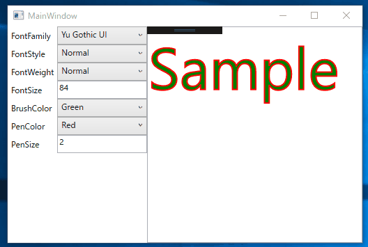

# WPF-Sample

WPF(C#)のサンプルのサンプルアプリケーションです。

## [FormattedTextBox](FormattedTextBox/)

入力された文字列を、FormattedTextを使って装飾して表示するTextBoxのサンプルです。

## [FormattedTextSample](FormattedTextSample/)

FormattedTextクラスのBaseline/Extent/OverhangAfter/OverhangLeading/OverhangTrailingプロパティを表示するサンプルアプリケーションです。

FormattedTextクラスのBaseline/Extent/OverhangAfter/OverhangLeading/OverhangTrailingプロパティが描画テキストのどの部分の値なのかわかりにくかったので、確認できるサンプルアプリケーションを作成しました。

